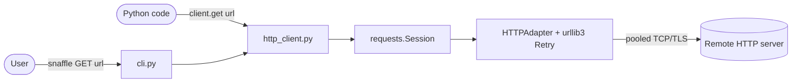
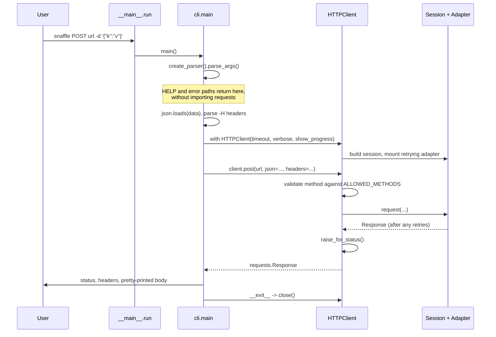

# Architecture overview

Snaffle is a thin, opinionated layer over `requests` and `urllib3`. It exists to
make two things convenient: a readable HTTP CLI, and a client whose retry and
pooling behaviour is decided once rather than at every call site.

It is deliberately small — six modules, no plugins, no configuration files, no
state on disk.

## System context

The only external dependency at runtime is the HTTP stack: `requests`, `tqdm`,
and `urllib3`. No database, queue, or service. Nothing is deployed — the
artifact is a wheel.

## Modules

| Module | Responsibility |
| --- | --- |
| `__init__.py` | Public API surface. Re-exports the exceptions eagerly and resolves `HTTPClient` lazily via PEP 562. |
| `__main__.py` | Process entry point for both `python -m snaffle` and the `snaffle` console script. The single process-level exit point: it turns `KeyboardInterrupt` into a clean exit, and `cli.main`'s returned code into the process status. |
| `cli.py` | Argument parsing, header and body parsing, response rendering, error-to-exit-code mapping. Imports `HTTPClient` only after the help paths have been ruled out. |
| `http_client.py` | The client: session construction, retry policy, method validation, exception translation. Asks `_download` whether to buffer a body, and hands it the body when the answer is yes. |
| `_download.py` | Private. Owns the progress-bar download whole: whether to drain, the size threshold, the deferred `tqdm` import, the chunk loop, and writing the buffer back onto the response. |
| `exceptions.py` | Three exception classes. No dependencies, not even on `requests`. |

The dependency graph is acyclic and shallow. `exceptions` depends on nothing;
`_download` depends on the HTTP stack; `http_client` depends on `exceptions`,
`_download`, and the HTTP stack; `cli` depends on `exceptions` at import time
and on `http_client` at call time.

`_download` imports `requests` at module scope, as `http_client` does. That is
safe because nothing reaches `_download` except through `http_client`, and
`http_client` itself is only imported once a request is actually being made —
see [ADR 0002](decisions/0002-lazy-imports-on-the-cli-help-path.md). `tqdm`
stays deferred inside `_download`, to a function.

Imports of first-party code are absolute throughout — `from snaffle.exceptions
import ...`, never relative.

## Request flow

Two properties of this flow are worth naming.

**Retries are invisible to the client code.** They happen inside the adapter, in
urllib3, below `Session.request`. `make_request` sees either a final response or
a `RetryError`. This is why a test that mocks `Session.request` cannot observe
retry behaviour at all.

**The error boundary is `make_request`.** Every `requests` exception is
translated there into this package's hierarchy, so callers — the CLI included —
never handle a `requests` type. The original is preserved on `__cause__`.

## Design commitments

### One client, one connection pool

A client holds a `requests.Session` with an `HTTPAdapter` mounted on both
schemes, pooling up to `POOL_SIZE` (16) connections. A second request to a host
skips the TCP and TLS handshake.

The cost is that a client owns an OS resource and must be closed. This is a
deliberate trade — it makes the common case (a batch of requests to one host)
fast, at the price of requiring a context manager. See
[ADR 0001](decisions/0001-selective-retries-and-connection-pooling.md).

### Retries are selective, and asymmetric by method

Only connection failures and the transient statuses in `RETRY_STATUSES` are
retried. Connection failures are retried for every method; read failures and
retryable statuses are retried only for idempotent methods. A `404` costs one
round trip. A `POST` is never replayed once it is on the wire.

That asymmetry is urllib3's, and Snaffle keeps it rather than flattening it.
See [ADR 0001](decisions/0001-selective-retries-and-connection-pooling.md).

### The help path does not import the network stack

`snaffle HELP`, `snaffle --help`, and argument errors never import `requests`.
This is enforced in two places — `cli.main` defers the import until after the
help branch, and `__init__.__getattr__` defers it for library users — and
guarded by a test that runs a subprocess and asserts `requests` is absent from
`sys.modules`. See
[ADR 0002](decisions/0002-lazy-imports-on-the-cli-help-path.md).

### `GET` streams only when something consumes the stream

Streaming a body that nothing reads holds a connection open for the lifetime of
the response. `GET` therefore streams on the client's own initiative only when a
progress bar is being fed. A caller who passes `stream=True` explicitly still
gets an unconsumed response: their request wins over the bar, because a bar is
fed by reading the body and reading it is what they asked to do themselves.

That whole decision lives in `_download.should_buffer`, not in `make_request`.
Draining reaches past the seam three times — it forces `stream=True`, writes
`response._content`, and writes `response._content_consumed` — so it is worth a
module with a name on it rather than four inline branches. An earlier revision
had it inline, and the `stream=True` opt-out above was documented in three
places while the code did the opposite.

### The distribution is typed

`mypy --strict` covers `src/` and `tests/`, and the wheel ships a PEP 561
`py.typed` marker, verified in CI by unzipping the built wheel. Downstream type
checkers use the annotations with no configuration.

## Testing strategy

Tests are `unittest`, one module per source module. They split into three
kinds, and the split is load-bearing:

- **Mocked at `Session.request`** — most client and CLI tests. Fast, and
  correct for anything *above* the adapter.
- **Asserted against `urllib3.util.retry.Retry` directly** — `TestRetryPolicy`.
  Verifies the policy object without any I/O.
- **Against a real socket** — `TestRetryAgainstRealServer` starts a
  `ThreadingHTTPServer` on an ephemeral port and counts arriving requests. This
  is the only way to observe retries end to end. `TestProgressAgainstRealServer`
  does the same for the streaming opt-out, which needs a real body to prove the
  socket is still unread.

The class docstring on `TestRetryPolicy` records why: an earlier revision
claimed "a `POST` is never silently re-sent" on the strength of a
`Session.request` mock, and the claim was wrong.

## Non-goals

Snaffle is not trying to be `curl`, `httpie`, or a general-purpose HTTP toolkit.
It does not:

- write downloaded bodies to files (the CLI prints to stdout),
- support non-JSON request bodies from the command line,
- offer authentication helpers, cookie jars, or session persistence,
- read configuration from files or environment variables,
- expose the retry count as a CLI flag.

Several of these are reachable through the [Python API](../reference/python-api.md)
because they fall out of forwarding `**kwargs` to `requests` — that is a
consequence of the design, not a supported CLI feature.
